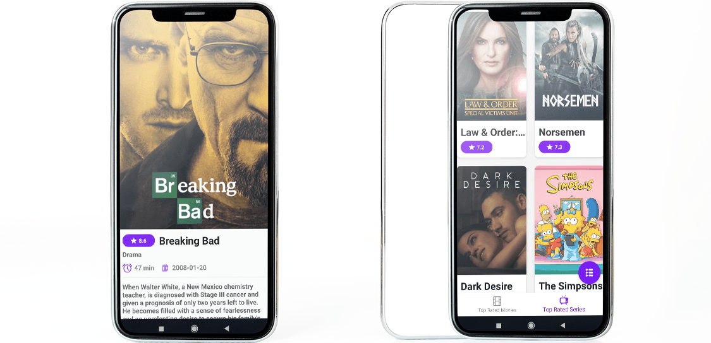

# AndroidMVPExample - themoviedb.org MVP integration
> Simple MVP-Kotlin list-based application.

[](https://kotlinlang.org/)
[](https://opensource.org/licenses/Apache-2.0)

MVP-Kotlin application, that allows the user to fetch movie and series information from a TMDB's API. :bowtie: It will make me very happy to your report about places you think have problems. :facepunch:



## Features

- [x] MVP - Kotlin
- [x] Dagger 2
- [x] RxJava 2
- [x] Motion Layout
- [x] Endless Pagination
- [x] Window activity transitions
- [x] Signing Configs
- [x] Application Variants
- [ ] RxBus
- [ ] Room
- [ ] Unit tests

## MVP Kotlin

The main purpose of MVP (Model - View - Presenter) is to separate the user interface from the business logic.

### MVP General Structure


## Motion Layout

Motion Layout is part of the ConstraintLayout 2.0 library. We can make animations easly that we previously made with hundreds of lines of code with Motion Layout. Thanks to this layout, you can add animations to your application very quickly and simply and make your application more attractive visually. For more visit GDP.

### Animation Samples

 

## Window Activity Transitions

Activity transitions in material design apps, connect different layout components with shared views. You can pass shared views to another activity on intent bundle. Provides professional transition effects to your application with a simple few lines of code. For more visit GDP.

```kotlin
val pairImage = Pair<View, String>(
    itemView.moviesImage,
    itemView.context.resources.getString(R.string.transitionImage)
)
val pairTitle = Pair<View, String>(
    itemView.moviesTitle,
    itemView.context.resources.getString(R.string.transitionTitle)
)
val pairStar = Pair<View, String>(
    itemView.cardStarHolder,
    itemView.context.resources.getString(R.string.transitionCard)
)

val activityOptions = ActivityOptions.makeSceneTransitionAnimation(
    moviesFragment.activity,
    pairImage,
    pairTitle,
    pairStar
)

activity.startActivity(intent, bundle)
```
### Transitions Samples

 


## Signing Configs and Application Variants

It is important to make these settings in your gradle file, not to forget application signing keys and to get correct output apks.

```kotlin
signingConfigs {
    release {
        readKeystorePropertiesAfterBuild()
    }
    debug {
        keyAlias 'key0'
        keyPassword '123456'
        storeFile file('movies_debug.jks')
        storePassword '123456'
    }
}

applicationVariants.all { variant ->
    variant.outputs.all {
        def versionName = variant.versionName
        def versionCode = variant.versionCode
        def variantName = variant.name
        outputFileName = variantName + '_' + versionName + '_' + versionCode + '.apk'
    }
}

def readKeystorePropertiesAfterBuild() {
    def propsFile = rootProject.file('keystore.properties')
    def configName = 'release'
    if (propsFile.exists() && android.signingConfigs.hasProperty(configName)) {
        def props = new Properties()
        props.load(new FileInputStream(propsFile))
        android.signingConfigs[configName].storeFile = file(props['storeFile'])
        android.signingConfigs[configName].storePassword = props['storePassword']
        android.signingConfigs[configName].keyAlias = props['keyAlias']
        android.signingConfigs[configName].keyPassword = props['keyPassword']
    }
}
```


## License

```
Copyright 2020 Egemen ÖZOGUL

Licensed under the Apache License, Version 2.0 (the "License");
you may not use this file except in compliance with the License.
You may obtain a copy of the License at

    http://www.apache.org/licenses/LICENSE-2.0

Unless required by applicable law or agreed to in writing, software
distributed under the License is distributed on an "AS IS" BASIS,
WITHOUT WARRANTIES OR CONDITIONS OF ANY KIND, either express or implied.
See the License for the specific language governing permissions and
limitations under the License.
```

